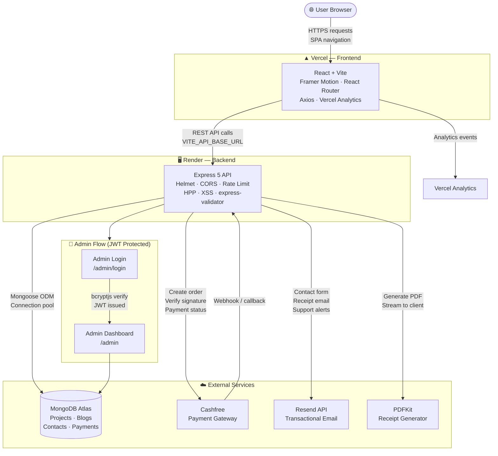

<div align="center">


### Building elegant UI, secure backend systems, and real-world services — one feature at a time


</div>

---

## About This Project

A **production-ready full-stack developer portfolio** built from scratch. This is far beyond a simple showcase — it is a complete web platform featuring:

- 🎨 Stunning animated portfolio frontend with **22 pages**
- 🔐 Secure JWT-authenticated **Admin Dashboard** (full CMS for projects & blogs)
- 💳 Real **Payment Gateway** integration (Cashfree) with PDF receipt generation
- 📧 **Transactional email** via Resend API (contact form, receipts, support)
- 🛡️ Multi-layer backend **security architecture**
- 📊 Journey timeline, skills, projects, blog, services, and contact sections
- 🚀 Production-deployed on **Vercel** (frontend) + **Render** (backend)

---

## Tech Stack

### Frontend

| Technology | Purpose |
|---|---|
| **React** (Vite) | UI framework with fast HMR build tooling |
| **Framer Motion** | Page transitions, micro-animations, scroll effects |
| **React Router DOM v6** | Client-side routing with lazy-loaded pages |
| **Axios** | HTTP client for API communication |
| **@vercel/analytics** | Privacy-friendly traffic analytics |
| **Vanilla CSS** | Custom design tokens — no Tailwind dependency |

---

### Backend

| Package | Version | Purpose |
|---|---|---|
| **Express** | ^5.2.1 | Web framework (v5 — native async error handling) |
| **Mongoose** | ^9.3.3 | MongoDB ODM with connection pooling |
| **jsonwebtoken** | ^9.0.3 | JWT access tokens |
| **bcryptjs** | ^3.0.3 | Password hashing (cost factor 12) |
| **express-validator** | ^7.3.1 | Input validation & sanitization |
| **express-rate-limit** | ^8.3.2 | Per-route rate limiting |
| **express-mongo-sanitize** | ^2.2.0 | NoSQL injection prevention |
| **helmet** | ^8.1.0 | Security headers (CSP, HSTS, X-Frame-Options) |
| **hpp** | ^0.2.3 | HTTP parameter pollution protection |
| **xss** | ^1.0.15 | XSS sanitization on user inputs |
| **cors** | ^2.8.6 | CORS with strict origin allowlist |
| **compression** | ^1.8.1 | Gzip response compression |
| **morgan** | ^1.10.1 | HTTP request logging |
| **pdfkit** | ^0.18.0 | Server-side PDF receipt generation |
| **resend** | ^6.10.0 | Transactional email delivery |
| **dotenv** | ^17.3.1 | Environment variable management |
| **nodemon** | ^3.1.14 | Dev auto-restart |

---

### Database

- **MongoDB Atlas** — Cloud-hosted MongoDB with replica set, connection pooling (`DB_MAX_POOL_SIZE`, `DB_MIN_POOL_SIZE`), and `ALLOW_START_WITHOUT_DB` recovery mode.

---

### Payment & Services

| Service | Purpose |
|---|---|
| **Cashfree Payment Gateway** | Order creation, signature verification, payment status |
| **Resend API** | Transactional emails for contact form, receipts, support |
| **PDFKit** | Server-side PDF receipt generation |
| **Receipt Portal** | Self-service receipt lookup by payment/order ID |

---

### Deployment & Tooling

| Platform | Purpose |
|---|---|
| **Vercel** | Frontend hosting with SPA route rewrites |
| **Render** | Backend Node.js web service |
| **MongoDB Atlas** | Production database |
| **UptimeRobot / cron-job.org** | Health ping to prevent Render cold-start |
| **Vercel Analytics** | Visitor analytics (no cookie banner needed) |

---

## Project Structure

```text
Developer Portfolio/
│
├── frontend/
│   ├── public/
│   ├── src/
│   │   ├── App.jsx                  # Root with routes & AnimatePresence
│   │   ├── main.jsx
│   │   ├── index.css                # Global CSS & design tokens
│   │   ├── assets/
│   │   ├── components/
│   │   │   ├── animations/          # Reusable animation wrappers
│   │   │   ├── auth/                # ProtectedRoute
│   │   │   ├── layout/              # Navbar, Footer, BackgroundGrid,
│   │   │   │                        # PortfolioLoader, ScrollProgressButton
│   │   │   ├── seo/                 # SEO / meta components
│   │   │   └── ui/                  # Shared UI components
│   │   ├── constants/               # Static data & config constants
│   │   ├── context/                 # React context providers
│   │   ├── hooks/                   # Custom React hooks
│   │   ├── pages/                   # All 22 page-level components
│   │   ├── services/                # Axios API service modules
│   │   └── utils/                   # Helper utilities
│   ├── vercel.json                  # SPA route rewrites
│   └── vite.config.js
│
└── backend/
    ├── scripts/
    │   └── seed.js                  # DB seeder script
    └── src/
        ├── server.js                # Entry point & HTTP server
        ├── app.js                   # Express app + middleware stack
        ├── config/                  # DB connection, env validation
        ├── constants/               # App-wide constants
        ├── controllers/             # Route handler logic
        ├── middleware/              # Auth, error, validation, XSS, rate limit
        ├── models/                  # Mongoose schemas
        ├── routes/                  # Express route definitions
        ├── services/                # Business logic (email, PDF, payment)
        └── utils/                   # Shared utility functions
```

---

## Pages & Routes

### Public Pages

| Route | Page | Description |
|---|---|---|
| `/` | Home | Hero section, intro, highlights |
| `/about` | About | Bio and personal details |
| `/skills` | Skills | Tech skills showcase |
| `/projects` | Projects | Project listing |
| `/projects/:slug` | Project Details | Individual project deep-dive |
| `/journey` | Journey | Timeline of education & work history |
| `/blog` | Blog | Blog post listing |
| `/blog/:slug` | Blog Details | Individual blog post |
| `/services` | Services | Freelance & consulting services offered |
| `/security` | Security | Platform security overview |
| `/contact` | Contact | Contact form with email delivery |

### Services & Payment Pages

| Route | Page | Description |
|---|---|---|
| `/support` | Support | Raise service tickets / get help |
| `/payment/success` | Payment Success | Post-payment confirmation screen |
| `/receipts` | Receipt Portal | Self-service receipt lookup by order ID |
| `/refund-policy` | Refund Policy | |
| `/privacy-policy` | Privacy Policy | |
| `/terms-and-conditions` | Terms | |
| `/cancellation-policy` | Cancellation Policy | |
| `/delivery-policy` | Delivery Policy | |

### Admin Pages (Protected)

| Route | Page | Description |
|---|---|---|
| `/admin/login` | Admin Login | JWT-based admin login |
| `/admin` | Admin Dashboard | Full CMS — manage projects, blogs, contacts |

---

## API Endpoints

### Auth

```
POST   /api/auth/login             Public — admin login, returns JWT
GET    /api/auth/verify            Protected — verify token validity
```

### Projects

```
GET    /api/projects               Public — list all projects
GET    /api/projects/:slug         Public — single project by slug
POST   /api/projects               Admin — create project
PUT    /api/projects/:id           Admin — update project
DELETE /api/projects/:id           Admin — delete project
```

### Blogs

```
GET    /api/blogs                  Public — list all blog posts
GET    /api/blogs/:slug            Public — single blog post
POST   /api/blogs                  Admin — create blog post
PUT    /api/blogs/:id              Admin — update blog post
DELETE /api/blogs/:id              Admin — delete blog post
```

### Contact

```
POST   /api/contact                Public — submit contact message (sends email)
```

### Admin (Protected)

```
GET    /api/admin/contacts         Admin — list all contact messages
PATCH  /api/admin/contacts/:id/read  Admin — mark message as read
```

### Payment

```
POST   /api/payment/create-order   Public — create Cashfree payment order
POST   /api/payment/verify         Public — verify payment signature
GET    /api/payment/status/:orderId  Public — get payment status
GET    /api/payment/receipt/:orderId  Public — download PDF receipt
```

### Health

```
GET    /api/health                 Public — server & DB health check
```

---

## Quick Start

### 1. Install dependencies

```bash
cd frontend && npm install
cd ../backend && npm install
```

### 2. Configure environment variables

```bash
cp backend/.env.example backend/.env
```

Required backend `.env` values:

```env
NODE_ENV=development
PORT=5000

MONGODB_URI=<your_mongodb_atlas_uri>

JWT_SECRET=<minimum_32_character_secret>
JWT_EXPIRES_IN=1d

ADMIN_EMAIL=<your_admin_email>
ADMIN_PASSWORD_HASH=<bcrypt_hash_of_your_password>

ALLOWED_ORIGINS=http://localhost:5173

# Email (Resend)
RESEND_API_KEY=<your_resend_api_key>
CONTACT_FROM_EMAIL=noreply@yourdomain.com
CONTACT_TO_EMAIL=your@email.com

# Payment (Cashfree)
CASHFREE_APP_ID=<your_cashfree_app_id>
CASHFREE_SECRET_KEY=<your_cashfree_secret_key>
CASHFREE_ENV=sandbox
```

Required frontend `.env` value:

```env
VITE_API_BASE_URL=http://localhost:5000/api
```

### 3. Generate admin password hash

```bash
node -e "import('bcryptjs').then(b => b.default.hash('YourPassword@123', 12).then(console.log))"
```

Copy the output hash into `ADMIN_PASSWORD_HASH` in your `backend/.env`.

### 4. Seed sample data (optional)

```bash
cd backend
npm run seed
```

### 5. Run the applications

**Backend** (runs on port 5000):

```bash
cd backend
npm run dev
```

**Frontend** (runs on port 5173):

```bash
cd frontend
npm run dev
```

| Service | URL |
|---|---|
| Frontend | `http://localhost:5173` |
| Backend | `http://localhost:5000` |
| Admin Login | `http://localhost:5173/admin/login` |
| Admin Dashboard | `http://localhost:5173/admin` |
| API Health | `http://localhost:5000/api/health` |

---

## Security Architecture

| Layer | Implementation |
|---|---|
| Security Headers | Helmet (CSP, HSTS, X-Frame-Options, referrer policy) |
| CORS | Strict origin allowlist + optional Vercel preview URL regex |
| Rate Limiting | Separate limiters for auth / contact / payment / general routes |
| Input Validation | `express-validator` on all POST/PUT routes |
| NoSQL Injection | `express-mongo-sanitize` |
| XSS | Custom sanitization middleware using `xss` package |
| HTTP Param Pollution | `hpp` middleware |
| Authorization | JWT Bearer token required on all admin routes |
| Password Storage | `bcryptjs` with cost factor 12 |
| Error Handling | Centralized middleware — no stack traces exposed in production |
| Compression | Gzip via `compression` |
| Logging | HTTP request logging via `morgan` |

Security documentation:

- [SECURITY.md](SECURITY.md)
- [DEPLOYMENT_SECURITY.md](DEPLOYMENT_SECURITY.md)
- [THREAT_MODEL.md](THREAT_MODEL.md)

---

## Deployment

### Backend — Render (Web Service)

| Setting | Value |
|---|---|
| Root Directory | `backend` |
| Build Command | `npm install` |
| Start Command | `npm start` |
| Health Check | `/api/health` |

**Required environment variables on Render:**

```
NODE_ENV=production
PORT=10000
MONGODB_URI=<atlas_connection_string>
JWT_SECRET=<32+ char secret>
JWT_EXPIRES_IN=1d
ADMIN_EMAIL=<email>
ADMIN_PASSWORD_HASH=<bcrypt hash>
ALLOWED_ORIGINS=https://your-vercel-app.vercel.app
RESEND_API_KEY=<key>
CASHFREE_APP_ID=<id>
CASHFREE_SECRET_KEY=<key>
CASHFREE_ENV=production
ALLOW_START_WITHOUT_DB=false
DB_MAX_POOL_SIZE=25
DB_MIN_POOL_SIZE=5
```

**Cold-start optimization (Render free tier):**

- Set up UptimeRobot or cron-job.org to ping `https://your-backend.onrender.com/api/health` every 5 minutes.
- Frontend automatically pre-warms the backend on page load.

**Troubleshooting:**

| Error | Fix |
|---|---|
| Exit status 1 | Check Render logs for missing env variable |
| `querySrv ECONNREFUSED` | Regenerate MongoDB Atlas connection string |
| `Could not connect to any servers` | Allow `0.0.0.0/0` in Atlas Network Access (test only) |
| Temporary recovery needed | Set `ALLOW_START_WITHOUT_DB=true` (DB routes return 503 until Atlas is fixed) |

Optional — for Vercel preview URL support:

```
ALLOWED_ORIGIN_REGEX=^https://.*\.vercel\.app$
```

---

### Frontend — Vercel

| Setting | Value |
|---|---|
| Project Root | `frontend` |
| Install Command | `npm install` |
| Build Command | `npm run build` |
| Output Directory | `dist` |

**Required environment variable on Vercel:**

```
VITE_API_BASE_URL=https://your-backend.onrender.com/api
```

> Keep `/api` at the end. Do **not** add a trailing `/`.

`frontend/vercel.json` handles SPA route rewrites so React Router deep links resolve correctly.

**Current live deployment values:**

- Render `ALLOWED_ORIGINS=https://nikhilxagr.vercel.app`
- Vercel `VITE_API_BASE_URL=https://dev-portfolio-r1ur.onrender.com/api`

---

## Changelog Highlights

| Version | What Was Added |
|---|---|
| v1.0 | Initial portfolio — Home, About, Projects, Contact, Admin |
| v1.1 | Blog system, Skills page, Journey timeline |
| v1.2 | Services page, Cashfree payment gateway, PDF receipts |
| v1.3 | Support page, Receipt portal, Resend email integration |
| v1.4 | Security page, Policy pages, Vercel Analytics, PortfolioLoader animation |

---

## Planned / Future Features

- [ ] Dark / light mode toggle
- [ ] Rich markdown blog editor in admin dashboard
- [ ] Blog image upload and cloud optimization
- [ ] Analytics dashboard for admin (visitor stats)
- [ ] GitHub activity feed integration
- [ ] Testimonials section

---

## System Architecture



### Main Data Flow

- **React** renders pages and calls the backend through `VITE_API_BASE_URL`
- All API requests pass through a **multi-layer security stack** (Helmet → CORS → Rate Limit → HPP → XSS → Validator)
- **MongoDB Atlas** stores projects, blogs, contact messages, and payment records
- Service payments are created through **Cashfree** — orders are created server-side, signatures verified on callback
- **Resend API** sends transactional emails for contact form submissions, payment receipts, and support tickets
- **PDFKit** generates payment receipts on-demand and streams them directly to the client
- **Admin routes** are fully protected — JWT token required, validated via middleware on every request
- **Vercel Analytics** passively tracks visitor data with no cookie consent required

---

## License

This repository is proprietary and released under all-rights-reserved terms.

- [LICENSE](LICENSE)

---

## Connect With Me

<div align="center">

[](https://www.linkedin.com/in/nikhilxagr)
[](https://github.com/nikhilxagr)
[](https://nikhilxagr.vercel.app)

</div>

---

<div align="center">

### ⭐ Star this repo if you find it useful

### Built with focus, consistency, and secure engineering principles


</div>
